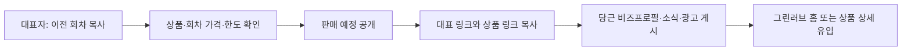
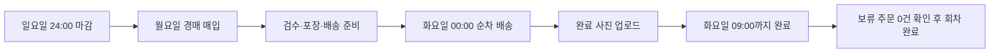
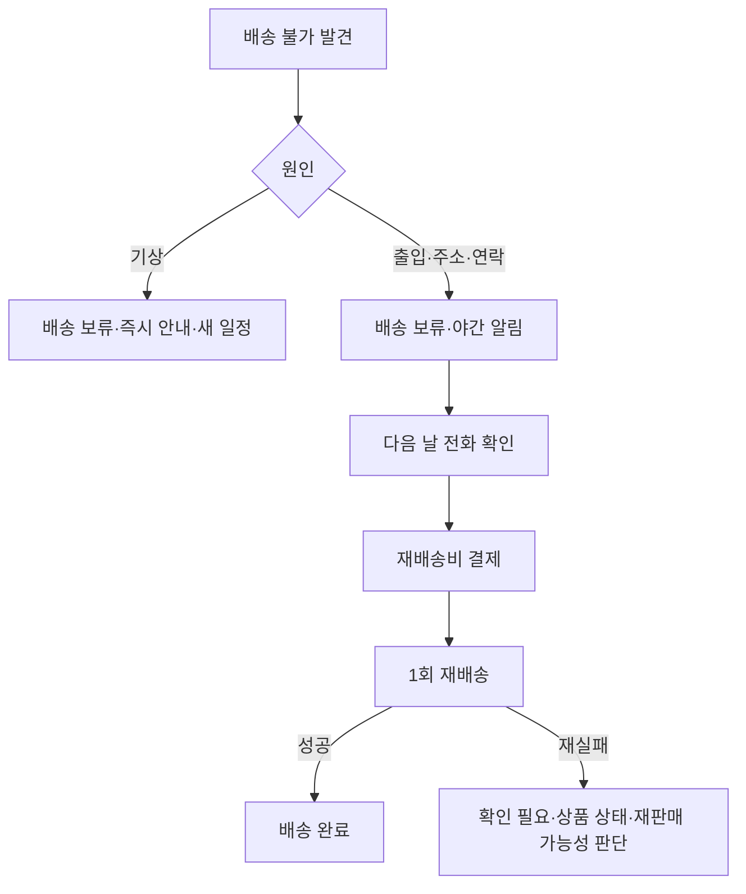

<!-- Language: ko -->

# Project Blueprint: 디어오키드 주간 판매 회차·직배송 MVP

## 문서 메타
- **작성일**: 2026-07-15
- **상태**: Task 4.5 완료, Task 4.6 착수 대기
- **Priority**: 1
- **Labels**: feature, refactor, payment, delivery, privacy
- **SSOT Check**: `docs/discussions/DISCUSS_mvp_sales_focus.md`, `docs/CRITICAL_LOGIC.md` #CL-57
- **Architectural Goal**: 기존 판매 방식을 보존하면서 디어오키드에만 회차 기반 직배송 주문 경로를 추가한다.
- **보정 결과**: `PLAN_mvp_sales_round_review_remediation.md` Task 0.1~4.6과 `PLAN_mvp_sales_round_build_gate_remediation.md` Task 0.1~3.3을 선행 완료했다. Task 2.10은 PortOne 테스트 채널의 실제 100원 결제, 중복 웹훅, timeout 후 예약 재확보, 한도 실패 전액 환불, 원격·로컬 상태 일치까지 staging에서 통과했다. Task 2.11은 고객 사유 첫 배송 실패의 재배송비 1회 생성, 같은 보류 재처리 멱등성, 재배송 실패 운영 예외 전환을 통과했다. Task 3.1은 알림톡 3회 재시도, 문자 대체, 키 누락 실패, 최종 실패 운영 예외의 테스트 계약을 고정했다. Task 3.2는 알림톡 최대 3회 시도, 동일 내용 문자 대체, 설정 누락 실패 처리를 구현했다. Task 3.3은 최종 실패 거래 알림의 멱등 `CUSTOMER_NOTICE_FAILED` 운영 예외를 구현했다. Task 3.4는 인증 사용자의 `alimtalk`, `sms` 마케팅 동의·철회만 엄격한 boolean으로 검증하고 기존 설정과 병합 저장하도록 구현했다. Task 3.5는 같은 `idempotencyKey`의 열린 예외 통합, 조치 직전 최신 상태 재검증, 성공·실패 조치의 안전한 `actions` 감사 기록 계약 6개를 테스트로 고정했다. Task 3.6은 결정적 문서 ID 기반 운영 예외 통합, 최신 상태 기반 환불·문자 조치, 성공·실패 감사 기록과 민감정보 배제를 구현했다. Task 3.7은 셀러·관리자 인증, 스토어 소유권 검증, 안전한 목록·상세·재조회 응답과 환불·문자 조치 API를 구현했다. Task 3.8은 운영 모듈과 런타임 라우트를 연결하고 알림·재배송 최종 실패 생성 경로를 공통 운영 서비스로 전환했다. Task 3.9는 배송 사진 90일, 마케팅 동의와 분쟁 기록 3년, 계약·결제·공급 기록 5년, 분쟁·법적 보존 연장과 멱등 파기 계약을 실패 테스트 8개로 고정했다. Task 3.10은 목적별 법정 기록 저장과 만료 쿼리, 분쟁·법적 보존 제외, 연결 사진과 Firestore 문서의 멱등 파기를 구현했다. Task 3.11은 `FirestoreModule`을 가져오는 `RetentionModule`에 보관 서비스를 provider로 등록하고 export했다. Task 3.12는 배송 사진의 서버 비공개 업로드, 주문 권한 확인 뒤 15분 V4 읽기 서명 URL, 보관 서비스용 삭제 어댑터를 구현했다. Task 3.13은 `StorageService`를 Firebase 인프라 모듈 provider/export에 등록하고 `RetentionService` 삭제 어댑터로 명시적으로 주입했다. Task 3.14는 이미 연결된 회차·운영 예외 모듈을 중복 등록하지 않고 누락된 `RetentionModule`만 `AppModule`에 추가했다. 현재 진입점은 Task 4.6이다.

## 업무 요약 (협업용)

### 개요
디어오키드는 매주 일요일 자정까지 주문을 받고 월요일 경매 후 화요일 오전 9시까지 이천시에 직접 배송한다. 당근 비즈니스는 고객 유입을 맡고, 상품 확인·결제·주문·배송 안내는 그린러브 한 곳에서 처리한다. 기존 택배·거점픽업·공동구매는 삭제하지 않고 디어오키드 소비자 화면에서만 숨긴다.

### 끝났을 때 확인할 것
- 대표자는 이전 회차를 복사해 이번 주 상품·가격·한도를 등록하고 당근용 링크를 얻는다.
- 고객은 현재 회차 상품만 장바구니에 담아 한 주문과 한 번의 결제로 구매한다.
- 이천시 밖 주소, 마감 회차, 한도 초과 주문은 결제 전에 차단된다.
- 월요일 매입부터 화요일 배송, 보류, 유료 재배송, 완료 사진까지 한 주문에서 추적된다.
- 결제·알림 실패는 자동 복구되고 최종 실패만 `확인 필요`에 남는다.
- 주문·분쟁·마케팅 동의 기록은 용도별 보관기간 후 자동 파기된다.

### 이번에 하지 않는 것
- 당근 앱 안 주문·결제와 그린러브 주문의 양방향 동기화
- 외부 셀러 입점·정산 중개와 지역별 배송기사 자동 배정
- 택배·거점픽업·공동구매 기존 데이터의 일괄 변환
- 대량 광고 캠페인 작성·발송 도구와 회원탈퇴 인증 흐름 전면 개편
- 목요일 소경매를 독립 정규 회차로 자동 생성하는 기능

## Origin Intent
- **출처**: `docs/discussions/DISCUSS_mvp_sales_focus.md`
- **원래 목적**: 준비되지 않은 판매 방식을 고객에게 동시에 약속하지 않고 이천시 주간 직배송 경험을 먼저 검증한다.
- **완료 관찰**: 당근 유입 고객은 그린러브에서 회차 상품을 결제하고 대표자는 하나의 운영 흐름으로 배송을 끝낸다.

## 운영 워크플로

### 1. 회차 개설과 당근 유입

- 대표 링크는 홈에 연결하고 현재 회차, 마감, 배송 조건, 지난 회차 순으로 보여준다.
- 상품 광고 링크는 `/products/{productId}?round={roundId}`에 당근 유입 값을 붙인다.
- 당근은 클릭·광고 성과를 확인하는 채널이며 주문·결제 결과는 그린러브 셀러앱에서 확인한다.

### 2. 고객 주문과 단일 결제

- 주문은 배송지 1곳을 1건으로 세고 상품 수량 합계를 회차 수량에 반영한다.
- 전화번호와 이천시 주소는 필수이며 마케팅 동의는 기본 해제된 선택 항목이다.
- 서버가 회차 상태·가격·수량을 다시 확인하며 변경된 항목은 고객 재확인 전 결제하지 않는다.

### 3. 매입과 배송

### 4. 배송 예외

## 데이터 계약

| 저장소 | 핵심 내용 | 접근 |
| :--- | :--- | :--- |
| `saleRounds` | 상태, 주문·경매·배송 시각, 이천시 지역, 배송지·수량 한도와 집계 | 공개 조회 API, 셀러 쓰기 API |
| `saleRoundItems` | 회차, 상품 원본, 회차 가격, 노출 순서 | 공개 조회 API, 셀러 쓰기 API |
| `checkoutReservations` | 15분 주소 1건·수량 임시 확보, 만료·소비·반환 상태 | 서버 전용 |
| `orders` | `schemaVersion: 2`, 회차, 주문 상품 스냅샷 배열, 배송·보류 상태 | 본인·내부 운영 조회 |
| `orderCharges` | 고객 사유 재배송비 결제와 시도 횟수 | 본인·내부 운영 조회 |
| `operationIssues` | 결제 조회·환불·문자·2차 배송 실패의 최종 수동 조치 | 내부 운영 전용 |
| `legalOrderRecords` | 계약·결제·공급 기록과 5년 파기 시각 | 서버·권한 관리자 전용 |
| `legalDisputeRecords` | 환불·분쟁·고객응대 기록과 3년 파기 시각 | 서버·권한 관리자 전용 |
| `marketingConsentLogs` | 동의 문구 버전, 채널, 동의·철회 시각과 3년 파기 시각 | 서버·권한 관리자 전용 |
| Firebase Storage | 비공개 `deliveryPhotos/{orderId}/{photoId}.jpg`, 기본 90일 | 서버 업로드·서명 URL 조회 |

### 상태 계약
- 회차: `DRAFT → SCHEDULED → OPEN → CLOSED → COMPLETED`, 대표자 취소는 `CANCELLED`.
- 신규 주문: `PENDING → ACCEPTED → PREPARING → DELIVERING → DELIVERED → REVIEWED`.
- 배송 보류: `PREPARING` 또는 `DELIVERING`에서 `DELIVERY_HELD`로 이동한 뒤 `PREPARING`, `DELIVERING`, `CANCELLED` 중 하나로 해소한다.
- 기존 주문 상태와 단일 상품 필드는 그대로 보존하고 조회 계층에서 주문 상품 1개로 정규화한다.
- `Store.salesMode`는 `legacy | round_direct`이며 값이 없으면 `legacy`로 처리한다.

## Edge Case Trace
| 엣지 케이스 | 처리 | Task-ID |
| :--- | :--- | :--- |
| 일요일 24:00 경계 결제 | 승인 완료 시각과 회차 마감 시각을 서버 KST 기준으로 비교 | 3.2, 4.2 |
| 15분 뒤 늦은 결제 | 포트원 재조회 후 한도 재확보, 불가하면 자동 전액 환불 | 4.1, 4.2 |
| 중복 웹훅 | 주문·한도·알림을 멱등 키로 한 번만 반영 | 4.1, 4.2 |
| 가격·수량 변경 장바구니 | 구매 불가 항목은 남기고 제외, 바뀐 값은 재확인 | 6.1, 6.8, 6.9 |
| 이천시 밖 주소 | 서버 주소 정책에서 주문 생성 차단 | 3.1, 3.4 |
| 기상 연기 | 판매자 책임 보류, 재배송비 없이 새 일정 통지 | 2.6, 5.9, 5.11 |
| 고객 사유 첫 실패 | 야간 알림 후 다음 날 연락, 재배송비 선결제 | 2.6, 2.11, 4.17 |
| 고객 사유 재배송 실패 | 자동 환불 판단 금지, 상태·재판매 기록을 확인 필요로 이관 | 3.6, 5.9 |
| 알림톡·문자 모두 실패 | 주문 상태 유지, 확인 필요 생성 | 5.1, 5.3 |
| 배송 사진 개인정보 | 서버 업로드, 본인·내부만 서명 URL, 90일 후 삭제 | 3.12, 5.12 |
| 과거 택배·거점·공구 주문 | 데이터 변환 없이 조회 시 단일 주문 상품으로 표시 | 3.5, 6.12 |
| 보류 주문이 남은 회차 | 회차 완료 거부 | 2.1, 2.3 |

## Diagnosis & Findings
- 현재 장바구니 결제는 상품마다 주문과 결제를 반복하므로 다중 상품이 한 주문으로 묶이지 않는다.
- 현재 `dailyCaps`는 배송지 수와 상품 수량을 분리하지 않고 수량만 차감한다.
- 현재 결제 타임아웃은 포트원 조회 없이 `PENDING` 주문을 취소해 늦은 결제와 충돌할 수 있다.
- 현재 알리고 키가 없으면 성공으로 기록되고 재시도·문자 대체가 구현되지 않았다.
- 현재 배송 사진은 거점 도착 전용이며 클라이언트가 Storage에 직접 올리지만 보안 규칙에는 허용 경로가 없다.
- 현재 소비자 홈·상품 상세·결제에는 공동구매, 택배, 거점픽업, 고객 선택 배송일이 함께 노출된다.

## Architectural Deepening
- **Seam**: 상품 원본, 판매 회차, 주문 스냅샷을 분리해 가격 변경이 과거 주문을 바꾸지 않게 한다.
- **Leverage**: 기존 `OrdersCreateService`, `PaymentsService`, `NotificationsService`를 유지하고 회차 주문 분기만 추가한다.
- **Compatibility**: 신규 주문만 `schemaVersion: 2`를 사용하며 기존 로직은 `salesMode: legacy`에서 그대로 동작한다.
- **Security**: 법정 보관 컬렉션과 배송 사진은 클라이언트 직접 접근을 계속 차단한다.
- **Release**: 디어오키드의 `salesMode`를 마지막에 전환해 단계별 구현 중 고객 화면 회귀를 막는다.

## Agent Completion Contract
- 각 Task는 선행 Task 완료 후 한 번에 하나씩 실행한다.
- 핵심 도메인 로직은 테스트 계약을 먼저 추가하고 구현 Task에서 통과시킨다.
- 각 Verify가 종료 코드 0인 경우에만 Conclusion을 실측 문장으로 바꾸고 다음 Task로 이동한다.
- 전체 구현 요청 후에는 Blueprint 구조를 고정하며 상태·Conclusion·Closeout만 갱신한다.
- 수정 코드 파일은 500줄 미만을 유지하고 `docs/memory.md`는 200줄 상한을 넘기지 않는다.

> **에이전트 스코프**: 사용자가 PLAN 전체 실행을 요청하면 아래 Dependency 순으로 진행한다. 각 Task는 표의 단일 Target만 수정하고 Verify 후 Conclusion과 Status를 닫는다.

## Execution Plan

### Phase 0. 명세와 공통 계약
| Task | Dependency | Target | Goal | Verify | Conclusion | Status |
| :--- | :--- | :--- | :--- | :--- | :--- | :--- |
| 0.1 | 없음 | `docs/specs/mvp-sales-round-direct-delivery.md` | 이 문서의 API·화면·보관 계약을 구현 명세로 고정한다. | `git diff --check -- docs/specs/mvp-sales-round-direct-delivery.md` | 통과 — 구현 명세 파일의 공백 오류가 없음을 확인했다. | done |
| 0.2 | 0.1 | `packages/shared/src/sale-round.types.ts` | 회차·회차 상품·예약·재배송비·운영 예외 타입을 정의한다. | `pnpm --filter @greenhub/shared typecheck` | 통과 — shared 타입체크가 회차·예약·운영 타입을 오류 없이 수용했다. | done |
| 0.3 | 0.2 | `packages/shared/src/order.types.ts` | 다중 주문 상품, `DELIVERY_HELD`, 회차·유입·보류 스냅샷을 하위 호환으로 추가한다. | `pnpm --filter @greenhub/shared typecheck` | 통과 — shared 타입체크가 주문 상태와 optional 회차 스냅샷 확장을 오류 없이 수용했다. | done |
| 0.4 | 0.3 | `packages/shared/src/notification.types.ts` | 배송 보류·재배송·운영 실패 알림 코드를 추가한다. | `pnpm --filter @greenhub/shared typecheck` | 통과 — shared 타입체크가 문자 채널과 배송 보류·재배송·운영 실패 알림 코드를 오류 없이 수용했다. | done |
| 0.5 | 0.4 | `packages/shared/src/store.types.ts` | `salesMode`의 legacy 기본 호환 계약을 추가한다. | `pnpm --filter @greenhub/shared typecheck` | 통과 — shared 타입체크가 `salesMode`와 `legacy` 기본 정규화 계약을 오류 없이 수용했다. | done |
| 0.6 | 0.5 | `packages/shared/src/index.ts` | 신규 공통 계약을 패키지 공개 API로 내보낸다. | `pnpm --filter @greenhub/shared build` | 통과 — shared ESM/CJS 빌드가 신규 회차 계약 공개 API와 dist 산출물을 오류 없이 생성했다. | done |

### Phase 1. 판매 회차 API
| Task | Dependency | Target | Goal | Verify | Conclusion | Status |
| :--- | :--- | :--- | :--- | :--- | :--- | :--- |
| 1.1 | 0.6 | `apps/api/src/sale-rounds/sale-rounds.service.spec.ts` | 상태 자동 전환·두 한도·보류 주문 완료 차단의 실패 테스트를 먼저 고정한다. | `pnpm --filter api test -- --listTests` | 통과 — Jest가 `sale-rounds.service.spec.ts`를 포함한 5개 테스트 파일을 수집했다. | done |
| 1.2 | 1.1 | `apps/api/src/sale-rounds/dto/sale-round.dto.ts` | 회차 생성·수정·복사 입력을 검증한다. | `pnpm --filter api build` | 통과 — API 빌드가 회차 생성·수정·복사 DTO 계약을 오류 없이 컴파일했다. | done |
| 1.3 | 1.2 | `apps/api/src/sale-rounds/sale-rounds.service.ts` | 회차 CRUD·복사·공개 조회·스케줄 전환을 트랜잭션으로 구현한다. | `pnpm --filter api test -- sale-rounds.service.spec.ts --runInBand` | 통과 — 회차 서비스 테스트 4개가 상태 자동 전환·배송지 한도·보류 완료 차단 계약을 검증했다. | done |
| 1.4 | 1.3 | `apps/api/src/sale-rounds/sale-rounds.controller.ts` | 공개 회차 조회와 셀러 회차 관리 엔드포인트를 역할별로 노출한다. | `pnpm --filter api build` | 통과 — 공개 회차 조회와 셀러 관리 컨트롤러가 API 빌드에 포함되어 컴파일됐다. | done |
| 1.5 | 1.4 | `apps/api/src/sale-rounds/sale-rounds.module.ts` | 회차 서비스를 주문 모듈에서 재사용할 수 있게 내보낸다. | `pnpm --filter api build` | 통과 — 회차 모듈이 컨트롤러와 서비스를 묶고 `SaleRoundsService`를 export한 상태로 API 빌드에 통과했다. | done |

### Phase 2. 회차 주문과 결제 복구
| Task | Dependency | Target | Goal | Verify | Conclusion | Status |
| :--- | :--- | :--- | :--- | :--- | :--- | :--- |
| 2.1 | 1.5 | `apps/api/src/orders/mvp-order-flow.spec.ts` | 이천 주소·다중 상품·예약·취소·보류·재배송비의 실패 테스트를 먼저 고정한다. | `pnpm --filter api test -- --listTests` | 통과 — Jest가 `mvp-order-flow.spec.ts`를 포함한 6개 테스트 파일을 수집했다. | done |
| 2.2 | 2.1 | `apps/api/src/orders/dto/create-order.dto.ts` | 회차 상품 배열, 필수 전화번호, 선택 마케팅 동의, 유입 값을 받도록 확장한다. | `pnpm --filter api build` | 통과 — API 빌드가 회차 상품 배열, 배송 전화번호, 마케팅 동의, 유입 DTO 확장을 오류 없이 컴파일했다. | done |
| 2.3 | 2.2 | `apps/api/src/orders/order-capacity.service.ts` | 주소 1건·수량 합계 예약을 확보·소비·반환하는 멱등 트랜잭션을 구현한다. | `pnpm --filter api test -- mvp-order-flow.spec.ts --runInBand` | 통과 — 회차 주문 흐름 테스트 6개가 결제 예약 확보·소비·반환 서비스와 활성 주문 계약을 오류 없이 검증했다. | done |
| 2.4 | 2.3 | `apps/api/src/orders/orders-create.service.ts` | `round_direct`에서 한 주문·상품 스냅샷 배열·단일 결제 요청을 만들고 legacy 분기를 보존한다. | `pnpm --filter api test -- mvp-order-flow.spec.ts --runInBand` | 통과 — 회차 주문 흐름 테스트 6개가 이천 주소 차단, 다중 상품 주문 스냅샷, 단일 결제 금액을 오류 없이 검증했다. | done |
| 2.5 | 2.4 | `apps/api/src/orders/orders-query.service.ts` | 신규 다중 상품과 기존 단일 상품을 같은 조회 응답으로 정규화한다. | `pnpm --filter api test -- mvp-order-flow.spec.ts --runInBand` | 통과 — 회차 주문 흐름 테스트 6개와 API 빌드가 기존 단일 상품 주문의 `orderItems` 정규화와 `DELIVERY_HELD` 조회 상태를 오류 없이 수용했다. | done |
| 2.6 | 2.5 | `apps/api/src/orders/orders-lifecycle.service.ts` | 마감 전 취소·`DELIVERY_HELD`·회차 완료 가드·부분 환불 기록을 구현한다. | `pnpm --filter api test -- mvp-order-flow.spec.ts --runInBand` | 통과 — 회차 주문 흐름 테스트 6개가 마감 전 고객 취소의 환불·한도 반환과 배송 보류 카운터 기록을 오류 없이 검증했다. | done |
| 2.7 | 2.6 | `apps/api/src/orders/orders.controller.ts` | 장바구니 검증·고객 취소·보류·재배송비·완료 사진 API 경로를 연결한다. | `pnpm --filter api build` | 통과 — 주문 컨트롤러가 회차 장바구니 검증, 고객 취소, 배송 보류, 재배송비, 배송 사진 경로를 빌드 오류 없이 노출한다. | done |
| 2.8 | 2.7 | `apps/api/src/orders/orders.module.ts` | 용량·결제·재배송비 의존성을 주문 모듈에 연결한다. 보관 의존성은 생성 이후 Task 3.11·3.14에서 연결한다. | `pnpm --filter api build` | 통과 — `OrdersModule`이 `OrderCapacityModule`과 `PaymentsModule`을 가져오고 `OrderChargesService`를 provider로 등록한 상태에서 API 빌드에 성공했다. | done |
| 2.9 | 2.8 | `apps/api/src/payments/payments.service.spec.ts` | 늦은 결제·중복 웹훅·한도 재확보 실패 자동 환불 테스트를 먼저 고정한다. | `pnpm --filter api test -- --listTests` | 통과 — Jest가 `payments.service.spec.ts`를 포함한 8개 테스트 파일을 수집했다. | done |
| 2.10 | 2.9 | `apps/api/src/payments/payments.service.ts` | 타임아웃 포트원 재조회와 주문·재배송비 결제의 멱등 확정을 구현한다. | `pnpm --filter api test -- payments.service.spec.ts --runInBand` | 통과 — 2026-07-17 KST Railway staging deployment `187e2ba9-e589-4dff-bee9-21fff9e17f7c`와 Firebase `green-staging-74557`에서 실제 100원 `PAID`, 주문·결제 금액 일치, `PAID` 웹훅 재발송 멱등성, timeout 후 새 예약 `CONSUMED`와 주문 `ACCEPTED` 복구, 한도 재확보 실패 시 PortOne 100원 전액 환불, 로컬 결제 `CANCELLED`·환불액 100원 기록, `CANCELLED` 웹훅 HTTP 200, 재발송 후 환불 1건·수량 불변을 확인했다. 관련 4개 스위트 31개 테스트, API 빌드, Biome 오류 수준 검사와 `git diff --check`가 통과했다. 상세 증거는 `REPORT_task_2_10_portone_staging_e2e.md`에 기록했다. | done |
| 2.11 | 2.10 | `apps/api/src/orders/order-charges.service.ts` | 고객 사유 첫 실패에 재배송비 결제 1회를 만들고 재실패는 운영 예외로 전환한다. | `pnpm --filter api test -- mvp-order-flow.spec.ts --runInBand` | 통과 — 첫 고객 사유 보류에만 주문 문서와 원자적으로 재배송비 1건을 만들고, 같은 보류의 다른 멱등 키 재처리는 기존 결제를 반환하며, 새 고객 사유 보류는 추가 결제 없이 멱등 `REDELIVERY_FAILED` 운영 예외 1건과 운영 확인 표시로 전환했다. 권한·비고객 사유·legacy 회귀를 포함한 주문 흐름 14개 테스트, 일반 결제 16개 테스트, API 빌드, Biome 오류 수준 검사와 `git diff --check`가 통과했다. | done |

### Phase 3. 알림·운영 예외·보관
| Task | Dependency | Target | Goal | Verify | Conclusion | Status |
| :--- | :--- | :--- | :--- | :--- | :--- | :--- |
| 3.1 | 2.11 | `apps/api/src/notifications/notifications-delivery.spec.ts` | 알림톡 3회·문자 대체·키 누락·최종 실패 기록 테스트를 먼저 고정한다. | `pnpm --filter api test -- --listTests` | 통과 — Jest가 신규 알림 전달 계약 파일을 포함한 12개 테스트 파일을 수집했다. 신규 7개 테스트 중 현재 구현이 이미 만족하는 성공·일반 알림 회귀 2개는 통과했고, 재시도·문자 대체·키 누락 실패 처리·`CUSTOMER_NOTICE_FAILED` 멱등 운영 예외 5개는 후속 구현 부재로 예상 실패했다. API 빌드, Biome 오류 수준 검사와 `git diff --check`가 통과했다. | done |
| 3.2 | 3.1 | `apps/api/src/notifications/aligo.client.ts` | 재시도와 문자 대체를 구현하고 키 누락 성공 오판을 제거한다. | `pnpm --filter api test -- notifications-delivery.spec.ts --runInBand` | 통과 — 알림톡 즉시 성공, 최대 3회 시도 후 성공 중단, 3회 실패 후 동일 내용 문자 대체, 필수 설정 누락 실패, 문자 성공 시 일반 알림 회귀의 5개 계약이 통과했다. 전체 7개 중 남은 2개 실패는 Task 3.3 대상인 `CUSTOMER_NOTICE_FAILED` 생성과 멱등성 미구현으로 한정됐다. API 빌드, 변경 파일 Biome 오류 수준 검사와 `git diff --check`가 통과했다. | done |
| 3.3 | 3.2 | `apps/api/src/notifications/notifications.service.ts` | 거래 알림 실패를 기록하고 최종 실패만 운영 예외로 생성한다. | `pnpm --filter api test -- notifications-delivery.spec.ts --runInBand` | 통과 — 문자 대체 성공 시 일반 알림 1건만 유지하고, 최종 실패 시 주문·템플릿별 결정적 문서 ID와 `customer-notice-failed:{orderId}:{templateCode}` 멱등 키로 `CUSTOMER_NOTICE_FAILED` 운영 예외를 최대 1건 생성했다. 운영 예외에는 전화번호·본문·비밀값 없이 실패 단계와 주문 상태만 기록하며 주문 상태는 변경하지 않는다. 알림 전달 계약 7개 테스트, API 빌드, 변경 파일 Biome 오류 수준 검사와 `git diff --check`가 통과했다. | done |
| 3.4 | 3.3 | `apps/api/src/notifications/notifications.controller.ts` | 마케팅 동의·철회를 검증된 채널 값으로 저장하게 한다. | `pnpm --filter api build` | 통과 — 기존 `PATCH /notifications/me/preferences`와 JWT 인증 흐름을 유지하고 `alimtalk`, `sms` 중 최소 한 채널의 엄격한 boolean만 허용했다. 알 수 없는 키와 잘못된 타입을 거부하고 인증 사용자 문서의 기존 설정과 병합해 요청하지 않은 채널을 보존하며 저장 완료 상태를 반환한다. 신규 설정 계약 12개와 기존 알림 전달 계약 7개, API 빌드, 변경 파일 Biome 오류 수준 검사와 `git diff --check`가 통과했다. | done |
| 3.5 | 3.4 | `apps/api/src/operations/operations.service.spec.ts` | 중복 예외 통합·최신 상태 재검증·조치 감사 기록 테스트를 먼저 고정한다. | `pnpm --filter api test -- --listTests` | 통과 — Jest가 신규 운영 계약 파일을 포함한 14개 테스트 파일을 수집했다. 신규 6개 테스트는 같은 `idempotencyKey`의 열린 항목 통합과 다른 주문·결제·실패 유형 분리, 환불·문자 조치 직전 최신 주문·결제·운영 예외 재조회, 성공·실패 `actions` 감사 기록과 민감정보 배제를 고정했다. 현재 `apps/api/src/operations/operations.service.ts`가 없어 6개 모두 Task 3.6 구현 부재로 예상 실패했다. 알림 7개, 결제 16개, 회차 주문·재배송 14개 회귀와 API 빌드, Biome 오류 수준 검사, `git diff --check`는 통과했다. | done |
| 3.6 | 3.5 | `apps/api/src/operations/operations.service.ts` | 결제·환불·알림·재배송 최종 실패를 멱등 `확인 필요` 항목으로 관리한다. | `pnpm --filter api test -- operations.service.spec.ts --runInBand` | 통과 — `idempotencyKey`를 해시한 결정적 문서 ID로 같은 실패 원인과 업무 대상을 하나의 열린 항목으로 통합하고 다른 주문·결제·실패 유형은 분리했다. 조치 직전에 운영 예외와 최신 주문·결제 상태를 다시 읽어 이미 환불되었거나 해결된 항목의 외부 호출을 반복하지 않으며, 환불 재시도와 문자 재발송의 성공·실패를 기존 `actions`에 누적한다. 실패 사유는 안전한 오류 메시지만 제한적으로 저장하고 민감 키가 포함되면 일반화한다. 운영 계약 6개, 알림 7개, 결제 16개, 회차 주문·재배송 14개, API 빌드, Biome 오류 수준 검사와 `git diff --check`가 통과했다. | done |
| 3.7 | 3.6 | `apps/api/src/operations/operations.controller.ts` | 셀러의 재조회·환불 재시도·문자 재발송·조치 기록 API를 노출한다. | `pnpm --filter api build` | 통과 — `GET /stores/:storeId/operation-issues`, 상세 조회, `POST .../:issueId/refresh`, `POST .../:issueId/actions`를 추가했다. JWT와 seller·admin 역할을 요구하고 seller는 서버가 조회한 `stores/{storeId}.ownerId`로 권한을 판정한다. 목록은 `storeId` Firestore 쿼리로 제한하고 상세·재조회·조치는 같은 스토어 경계를 재검증한다. 조치의 `actorId`는 인증 사용자 ID로 고정하며 허용 유형은 `RETRY_REFUND`, `RESEND_SMS`뿐이고 실행은 `OperationsService.executeAction`을 통과한다. 응답은 상태·식별자·안전한 스냅샷·감사 필드만 허용한다. 신규 컨트롤러 계약 9개, 운영 6개, 알림 7개, 결제 16개, 회차 주문·재배송 14개, API 빌드, 변경 파일 Biome 오류 수준 검사와 `git diff --check`가 통과했다. | done |
| 3.8 | 3.7 | `apps/api/src/operations/operations.module.ts` | 운영 예외 서비스를 결제·알림·주문에서 재사용할 수 있게 내보낸다. | `pnpm --filter api build` | 통과 — `OperationsModule`이 결제·알림 의존성과 컨트롤러·서비스를 연결하고 서비스를 export했으며, `AppModule` 런타임 라우트 등록과 알림·재배송 최종 실패의 공통 `createOrMergeIssue` 전환을 완료했다. 신규 모듈 3개를 포함한 관련 67개 테스트, API 빌드, Biome 오류 수준 검사와 `git diff --check`가 통과했다. | done |
| 3.9 | 3.8 | `apps/api/src/retention/retention.service.spec.ts` | 90일·3년·5년 만료와 분쟁 연장 파기 테스트를 먼저 고정한다. | `pnpm --filter api test -- --listTests` | 통과 — Jest가 신규 보관 계약 파일을 포함한 17개 테스트 파일을 수집했다. 신규 8개 테스트는 배송 사진 90일, 마케팅 동의·분쟁 기록 3년, 계약·결제·공급 기록 5년의 목적별 `expiresAt`, 진행 중 분쟁과 법적 보존 사유의 파기 제외, 미만료 제외, 목적별 쿼리 분리, 모의 Firestore 배치·Storage 삭제와 재실행 멱등성, 개인정보·비밀값 배제를 고정했다. 8개 모두 `apps/api/src/retention/retention.service.ts` 부재를 명시하는 예상 실패로 확인했다. 기존 운영 예외·알림·결제·주문 6개 스위트 55개 테스트, API 빌드, Biome 오류 수준 검사와 `git diff --check`가 통과했다. | done |
| 3.10 | 3.9 | `apps/api/src/retention/retention.service.ts` | 법정 기록 분리 저장과 Firestore·Storage 정기 파기를 구현한다. | `pnpm --filter api test -- retention.service.spec.ts --runInBand` | 통과 — 배송 사진 90일, 마케팅 동의와 환불·분쟁·고객응대 기록 3년, 계약·결제·공급 기록 5년의 목적별 `expiresAt`과 분리 컬렉션 저장을 구현했다. 목적별 만료 쿼리에서 진행 중 분쟁과 `legalHold`를 제외하고, 연결 사진은 Storage 삭제 어댑터로 제거한 뒤 Firestore 문서를 단일 배치로 삭제하며 빈 대상에는 부작용을 만들지 않는다. 신규 8개와 기존 6개 스위트 55개 테스트, API 빌드, Biome 오류 수준 검사와 `git diff --check`가 통과했다. | done |
| 3.11 | 3.10 | `apps/api/src/retention/retention.module.ts` | 보관 서비스를 주문·결제·알림에서 재사용할 수 있게 내보낸다. | `pnpm --filter api build` | 통과 — `RetentionModule`이 `FirestoreModule`을 가져오고 `RetentionService`를 provider로 등록해 export한다. Storage 구현·토큰, `AppModule`, 주문·결제·알림 호출 경로는 후속 Task 범위로 유지했다. 신규 모듈 계약 2개를 포함한 보관·운영 예외·알림·결제·주문 8개 스위트 68개 테스트, API 빌드, 변경 파일 Biome 오류 수준 검사와 `git diff --check`가 통과했다. | done |
| 3.12 | 3.11 | `apps/api/src/firestore/storage.service.ts` | 배송 사진을 비공개 업로드하고 권한 확인 후 단기 서명 URL을 발급한다. | `pnpm --filter api build` | 통과 — `deliveryPhotos/{orderId}/{photoId}.jpg` 경로에 JPEG를 서버 업로드하고 private/no-store 메타데이터와 CRC32C 검증을 적용했다. 업로드는 관리자·스토어 소유 셀러·배정 기사, 읽기는 여기에 주문자 본인을 추가해 서버가 주문과 스토어 경계를 확인한 뒤에만 허용한다. 읽기 URL은 V4 읽기 전용 15분 만료로 발급하며 공개 ACL·공개 URL·클라이언트 직접 업로드 경로는 만들지 않았다. 보관 서비스가 재사용할 `deleteObject`는 배송 사진 경로만 받고 미존재 삭제를 멱등 처리한다. 신규 Storage 5개를 포함한 관련 13개 스위트 89개 테스트, API 빌드, 변경 파일 Biome 오류 수준 검사와 `git diff --check`가 통과했다. | done |
| 3.13 | 3.12 | `apps/api/src/firestore/firestore.module.ts` | 서버 Storage 어댑터를 주입·내보내도록 Firebase 인프라 모듈을 확장한다. | `pnpm --filter api build` | 통과 — `StorageService`를 `FirestoreModule` provider/export에 등록해 기존 `FIREBASE_APP`과 `FirestoreService`를 재사용하도록 연결했다. Firebase Admin 초기화에는 `FIREBASE_STORAGE_BUCKET`을 우선 적용하고 미설정 시 기존 project ID의 기본 Appspot bucket을 사용하며, `.env.example`에 비밀값이 아닌 bucket 이름 계약을 추가했다. `RetentionService`의 삭제 어댑터는 `@Inject(StorageService)`로 명시했다. 신규 모듈 계약 3개를 포함한 관련 15개 스위트 98개 테스트, API 빌드, 변경 TypeScript 파일 Biome 오류 수준 검사와 `git diff --check`가 통과했다. `AppModule` 및 주문·드라이버 실제 호출 경로는 변경하지 않았다. | done |
| 3.14 | 3.13 | `apps/api/src/app.module.ts` | 회차·운영 예외·보관 모듈을 애플리케이션에 최종 연결한다. | `pnpm --filter api build` | 통과 — `SaleRoundsModule`과 `OperationsModule`은 기존 AppModule 등록을 유지하고, 실제 누락된 `RetentionModule`만 한 번 추가했다. 신규 AppModule 계약 테스트는 세 모듈의 단일 등록과 기능 provider 비중복을 고정한다. Firebase Admin 앱·Storage provider를 재등록하거나 새 `forwardRef`를 추가하지 않았고 주문·드라이버 배송 사진 호출 경로와 공개 Storage 경계도 변경하지 않았다. 관련 15개 스위트 94개 테스트, API 빌드, 변경 TypeScript 파일 Biome 오류 수준 검사와 `git diff --check`가 통과했다. | done |

### Phase 4. 소비자앱 단순화
| Task | Dependency | Target | Goal | Verify | Conclusion | Status |
| :--- | :--- | :--- | :--- | :--- | :--- | :--- |
| 4.1 | 3.14 | `apps/e2e/tests/consumer-round-direct.spec.ts` | 홈·상세·장바구니·결제·주문상세 계약을 먼저 수집한다. | `pnpm --filter e2e exec playwright test consumer-round-direct --list` | 통과 — 현재·지난 회차 홈, 회차 가격·마감·직배송 상세, 같은 회차 장바구니와 변경·마감 제외, 다중 상품 단일 결제와 필수·선택 동의·변경 재확인, 다중 상품·배송 보류·재배송비·완료 사진·마감 전 취소 주문 상세를 논리 계약 10개로 수집했다. 공개 4개와 기존 `AUTH_STATE_PATH`를 재사용한 인증 6개를 `test.fixme`로 고정해 Task 4.2~4.18 구현 전 외부 서비스나 실제 데이터 호출 없이 보존했다. chromium·mobile 20개 테스트와 기존 소비자 5개 파일 68개 테스트 목록 수집, 변경 파일 Biome 오류 수준 검사와 `git diff --check`가 통과했다. | done |
| 4.2 | 4.1 | `apps/consumer/src/hooks/useSaleRounds.ts` | 현재·지난 회차 공개 API 상태를 한 훅에서 제공한다. | `pnpm --filter consumer exec tsc --noEmit` | 통과 — 공개 회차 목록과 상세 API를 결합해 `loading`, `error`, `empty`, `success` 상태와 현재·지난 회차, 전체 회차, 재조회 기능을 제공했다. 늦은 응답의 상태 덮어쓰기를 차단했고 신규 Node 테스트 4개와 consumer 타입검사가 통과했다. | done |
| 4.3 | 4.2 | `apps/consumer/src/lib/acquisition.ts` | 당근 유입 값을 보관해 주문 요청에 스냅샷으로 전달한다. | `pnpm --filter consumer exec tsc --noEmit` | 통과 — 당근 UTM 유입의 캠페인·콘텐츠와 민감 쿼리를 제거한 도착 URL을 탭 세션에 보관하고, 공유 주문 계약의 다섯 필드만 재검증해 새 스냅샷으로 제공한다. SSR·저장소 접근 거부·잘못된 저장값을 안전하게 처리했으며 신규 Node 테스트 6개와 consumer 타입검사가 통과했다. | done |
| 4.4 | 4.3 | `apps/consumer/src/components/HomeProductList.tsx` | 현재 회차·마감·직배송 조건·지난 회차 순서로 홈을 재구성한다. | `pnpm --filter consumer exec tsc --noEmit` | 통과 — 공개 상품의 단일 `storeId`와 공개 스토어 `salesMode`를 사용해 `round_direct` 홈만 현재 회차·마감·이천 직접배송·화요일 배송 약속·지난 회차 순서로 구성했다. 회차 판정은 `useSaleRounds` 정본을 재사용하고 상품 링크에 `productId`와 `roundId`를 보존했으며, legacy 홈과 명시적 로딩·오류·빈 상태를 유지했다. 신규 Node 계약 테스트 4개와 consumer 타입검사가 통과했다. | done |
| 4.5 | 4.4 | `apps/consumer/src/app/category/page.tsx` | 현재·지난 회차의 호접란만 상품 목록으로 제공한다. | `pnpm --filter consumer exec tsc --noEmit` | 통과 — 공개 상품의 단일 `storeId`와 공개 스토어 `salesMode`로 분기하고 `round_direct`에서는 `useSaleRounds`의 현재·지난 회차 항목을 공개 상품과 `productId`로 결합해 활성 호접란만 노출했다. 회차 가격과 현재·지난 구분을 표시하고 링크에 `productId`와 `roundId`를 보존했으며, 명시적 로딩·오류·빈 상태와 legacy 카테고리 흐름을 유지했다. 신규 Node 계약 테스트 5개와 consumer 타입검사가 통과했다. | done |
| 4.6 | 4.5 | `apps/consumer/src/components/BottomNav.tsx` | 홈·상품·장바구니·MY 네 항목만 노출한다. | `pnpm --filter consumer exec tsc --noEmit` | [판정 대기 — 소비자 내비게이션] | todo |
| 4.7 | 4.6 | `apps/consumer/src/app/groupbuy/page.tsx` | `round_direct`에서 공동구매 직접 진입을 홈으로 돌린다. | `pnpm --filter consumer exec tsc --noEmit` | [판정 대기 — 숨김 경로] | todo |
| 4.8 | 4.7 | `apps/consumer/src/app/products/[id]/page.tsx` | 회차 파라미터로 현재·마감 회차 상품을 구분해 내려준다. | `pnpm --filter consumer exec tsc --noEmit` | [판정 대기 — 상세 진입] | todo |
| 4.9 | 4.8 | `apps/consumer/src/app/products/[id]/_components/RoundPurchasePanel.tsx` | 회차 가격·마감·화요일 배송·이천·기상 원칙·구매 가능 상태를 표시한다. | `pnpm --filter consumer exec tsc --noEmit` | [판정 대기 — 회차 구매 패널] | todo |
| 4.10 | 4.9 | `apps/consumer/src/app/products/[id]/_components/ProductActions.tsx` | 택배·거점·공구·날짜 선택을 제거하고 회차 패널에 구매 동작을 위임한다. | `pnpm --filter consumer exec tsc --noEmit` | [판정 대기 — 상세 단순화] | todo |
| 4.11 | 4.10 | `apps/consumer/src/hooks/useCart.ts` | 회차·회차 가격을 저장하고 같은 회차 상품만 하나의 장바구니로 묶는다. | `pnpm --filter consumer exec tsc --noEmit` | [판정 대기 — 장바구니 모델] | todo |
| 4.12 | 4.11 | `apps/consumer/src/app/cart/page.tsx` | 서버 재검증 결과로 변경·마감 상품을 남겨 표시하고 결제 대상만 선별한다. | `pnpm --filter consumer exec tsc --noEmit` | [판정 대기 — 장바구니 검증] | todo |
| 4.13 | 4.12 | `apps/consumer/src/hooks/usePayment.ts` | 다중 상품 주문 하나와 포트원 결제 한 번을 처리하도록 결제 훅을 확장한다. | `pnpm --filter consumer exec tsc --noEmit` | [판정 대기 — 결제 훅] | todo |
| 4.14 | 4.13 | `apps/consumer/src/app/checkout/page.tsx` | 장바구니 전체를 한 주문과 한 번의 포트원 결제로 처리한다. | `pnpm --filter consumer exec tsc --noEmit` | [판정 대기 — 단일 결제] | todo |
| 4.15 | 4.14 | `apps/consumer/src/app/checkout/_components/CheckoutForm.tsx` | 전화번호·이천 주소·필수 고지·선택 마케팅 동의·변경 재확인을 제공한다. | `pnpm --filter consumer exec tsc --noEmit` | [판정 대기 — 결제 확인 화면] | todo |
| 4.16 | 4.15 | `apps/consumer/src/app/order/success/page.tsx` | 회차 주문번호·상품 요약·화요일 배송 약속을 결제 완료 화면에 표시한다. | `pnpm --filter consumer exec tsc --noEmit` | [판정 대기 — 주문 완료] | todo |
| 4.17 | 4.16 | `apps/consumer/src/app/mypage/_client.tsx` | 다중 상품 대표명과 배송 보류를 주문 목록에 표시한다. | `pnpm --filter consumer exec tsc --noEmit` | [판정 대기 — 주문 목록] | todo |
| 4.18 | 4.17 | `apps/consumer/src/app/mypage/orders/[id]/_client.tsx` | 다중 상품·보류·재배송비 결제·완료 사진·마감 전 취소를 표시한다. | `pnpm --filter consumer exec tsc --noEmit` | [판정 대기 — 주문 상세] | todo |
| 4.19 | 4.18 | `apps/consumer/src/app/mypage/notifications/settings/page.tsx` | 카카오톡·문자 마케팅 동의 상태와 즉시 철회를 제공한다. | `pnpm --filter consumer exec tsc --noEmit` | [판정 대기 — 동의 철회 화면] | todo |

### Phase 5. 셀러·드라이버 운영
| Task | Dependency | Target | Goal | Verify | Conclusion | Status |
| :--- | :--- | :--- | :--- | :--- | :--- | :--- |
| 5.1 | 4.19 | `apps/e2e/tests/seller-sale-rounds.spec.ts` | 회차 복사·예약·마감·완료·확인 필요 계약을 먼저 수집한다. | `pnpm --filter e2e exec playwright test seller-sale-rounds --list` | [판정 대기 — 셀러 계약 수집] | todo |
| 5.2 | 5.1 | `apps/seller/src/hooks/useSaleRounds.ts` | 셀러 회차 목록·저장·복사·상태 변경 API를 캡슐화한다. | `pnpm --filter seller exec tsc --noEmit` | [판정 대기 — 셀러 회차 훅] | todo |
| 5.3 | 5.2 | `apps/seller/src/app/sale-rounds/page.tsx` | 회차 상태·주문·수량·한도와 이전 회차 복사를 제공한다. | `pnpm --filter seller exec tsc --noEmit` | [판정 대기 — 회차 목록] | todo |
| 5.4 | 5.3 | `apps/seller/src/app/sale-rounds/[id]/RoundForm.tsx` | 한 화면에서 일정·지역·한도·상품·가격·당근 링크를 편집한다. | `pnpm --filter seller exec tsc --noEmit` | [판정 대기 — 회차 편집] | todo |
| 5.5 | 5.4 | `apps/seller/src/app/sale-rounds/[id]/page.tsx` | 회차 조회·저장·상태 변경을 RoundForm에 연결하는 라우트를 제공한다. | `pnpm --filter seller exec tsc --noEmit` | [판정 대기 — 회차 편집 라우트] | todo |
| 5.6 | 5.5 | `apps/seller/src/components/BottomNav.tsx` | 주문·회차·상품·준비·설정을 주요 메뉴로 둔다. | `pnpm --filter seller exec tsc --noEmit` | [판정 대기 — 셀러 내비게이션] | todo |
| 5.7 | 5.6 | `apps/seller/src/app/settings/page.tsx` | 정산·기존 배송·거점 관리 접근을 설정 화면에 유지한다. | `pnpm --filter seller exec tsc --noEmit` | [판정 대기 — 기존 기능 접근] | todo |
| 5.8 | 5.7 | `apps/seller/src/app/orders/page.tsx` | 배송 보류와 확인 필요 건수를 업무 우선순위로 표시한다. | `pnpm --filter seller exec tsc --noEmit` | [판정 대기 — 주문 운영 목록] | todo |
| 5.9 | 5.8 | `apps/seller/src/app/orders/[id]/page.tsx` | 새 일정·재배송비·연락 기록·환불 재시도·분쟁 기록 조치를 제공한다. | `pnpm --filter seller exec tsc --noEmit` | [판정 대기 — 셀러 조치 화면] | todo |
| 5.10 | 5.9 | `apps/e2e/tests/driver-direct-delivery.spec.ts` | 배송 시작·보류·사진 완료 계약을 먼저 수집한다. | `pnpm --filter e2e exec playwright test driver-direct-delivery --list` | [판정 대기 — 드라이버 계약 수집] | todo |
| 5.11 | 5.10 | `apps/driver/src/app/board/[orderId]/page.tsx` | 직접배송 완료 전에 사진 촬영을 요구하고 보류 사유를 기록한다. | `pnpm --filter driver exec tsc --noEmit` | [판정 대기 — 배송 조치] | todo |
| 5.12 | 5.11 | `apps/driver/src/app/board/[orderId]/photo/page.tsx` | 클라이언트 Storage 직접 업로드를 서버 비공개 업로드로 교체한다. | `pnpm --filter driver exec tsc --noEmit` | [판정 대기 — 완료 사진] | todo |

### Phase 6. 보안 규칙·통합 검증·출시
| Task | Dependency | Target | Goal | Verify | Conclusion | Status |
| :--- | :--- | :--- | :--- | :--- | :--- | :--- |
| 6.1 | 5.12 | `firestore.indexes.json` | 회차 공개 조회·만료 예약·보관 파기·운영 예외 쿼리 인덱스를 추가한다. | `pnpm --filter api build` | [판정 대기 — 인덱스 계약] | todo |
| 6.2 | 6.1 | `firestore.rules` | 회차 쓰기·예약·법정 기록·운영 예외의 클라이언트 직접 접근을 차단한다. | `pnpm --filter api build` | [판정 대기 — Firestore 경계] | todo |
| 6.3 | 6.2 | `storage.rules` | 배송 사진 직접 접근 차단과 기존 공개 상품 이미지 규칙을 함께 검증한다. | `pnpm --filter api build` | [판정 대기 — Storage 경계] | todo |
| 6.4 | 6.3 | `apps/api/test/mvp-sales-round.e2e-spec.ts` | 회차 개설부터 결제·보류·재배송·파기까지 서버 통합 계약을 검증한다. | `pnpm --filter api test:e2e -- mvp-sales-round.e2e-spec.ts --runInBand` | [판정 대기 — API 통합] | todo |
| 6.5 | 6.4 | `scripts/enable-dear-orchid-round-direct.mjs` | 대상 storeId·현재 모드·확인 플래그를 검사한 뒤 판매 모드를 전환한다. | `node scripts/enable-dear-orchid-round-direct.mjs --dry-run` | [판정 대기 — 전환 준비] | todo |
| 6.6 | 6.5 | `docs/specs/ops/mvp-sales-round-runbook.md` | 주간 운영·장애 대응·롤백·수동 환불 절차를 운영 문서로 고정한다. | `git diff --check -- docs/specs/ops/mvp-sales-round-runbook.md` | [판정 대기 — 운영 런북] | todo |
| 6.7 | 6.6 | `apps/e2e/tests/consumer-round-direct.spec.ts` | 소비자·셀러·드라이버 핵심 흐름을 실행해 화면 계약을 닫는다. | `pnpm --filter e2e exec playwright test consumer-round-direct seller-sale-rounds driver-direct-delivery --reporter=list` | [판정 대기 — 전체 사용자 흐름] | todo |
| 6.8 | 6.7 | `docs/plans/PLAN_mvp_sales_round_direct_delivery.md` | 전체 빌드·테스트 결과와 잔여 위험을 Closeout에 기록한다. | `pnpm build` | [판정 대기 — 최종 빌드] | todo |

## 출시 순서
1. `salesMode` 기본값을 `legacy`로 둔 채 회차 API와 셀러 화면을 배포한다.
2. 테스트 회차를 생성해 공개 조회, 예약, 결제, 보류, 사진, 파기를 비운영 데이터로 검증한다.
3. 디어오키드 회차를 `SCHEDULED`로 준비하고 당근 대표·상품 링크를 사전 확인한다.
4. 소비자·셀러·드라이버 통합 검증이 통과한 뒤에만 디어오키드 `salesMode`를 `round_direct`로 전환한다.
5. 첫 2개 회차는 배송지 15곳·호접란 30개 한도를 유지하며 확인 필요 목록을 매일 점검한다.

## 롤백
- 소비자 장애 시 디어오키드 `salesMode`를 `legacy`로 되돌려 신규 회차 주문 진입을 막는다.
- 이미 결제된 회차 주문은 모드와 무관하게 셀러·드라이버앱에서 계속 처리한다.
- 결제 상태가 불명확하면 주문을 임의 취소하지 않고 포트원 재조회와 `확인 필요` 절차를 따른다.
- 회차 데이터와 신규 주문은 삭제하지 않으며 원인 수정 후 다시 `round_direct`를 활성화한다.

## 완료 기준
- 모든 Task의 Status가 `done`이고 Conclusion에 실제 검증 결과가 기록되어 있다.
- 기존 주문 조회와 legacy 주문 생성 회귀 테스트가 통과한다.
- 회차 한도 경쟁, 늦은 결제, 중복 웹훅, 알림 실패, 배송 보류, 사진 권한 테스트가 통과한다.
- 디어오키드 고객 화면에서 택배·거점픽업·공동구매·외부 셀러 진입점이 보이지 않는다.
- 대표자는 월요일 매입과 화요일 배송을 셀러·드라이버앱만으로 마칠 수 있다.
- `docs/memory.md`, `docs/CRITICAL_LOGIC.md`, 구현 파일의 라인 제한을 준수한다.

## Closeout Roll-up
- **Status**: Task 4.5 완료, Task 4.6 `todo`
- **Task 4.2 복귀 조건**: 충족. 결제·예약·환불, 주문·웹훅 권한, 주문·회차 취소, 주문 생성 멱등, 재배송비, 알림, 운영 예외, 보관·Storage 입력 계약을 Unit 1~9에서 보정했고 Unit 10에서 실제 도메인 서비스 통합 E2E와 전체 회귀 검증으로 확정했다.
- **Task 4.2 결과**: 공개 목록과 회차별 상세를 병렬 조회해 회차 상품을 포함한 전체 회차, 현재 회차 하나, 최신순 지난 회차를 제공한다. 기존 소비자 데이터 접근 방식의 문자열 오류와 `loading` 불리언을 유지하면서 명시적 `error`, `empty`, `success` 상태와 재조회를 추가했고 요청 식별자로 스토어 전환·재조회 경쟁의 늦은 응답을 폐기한다.
- **Task 4.3 결과**: `utm_source=carrot|daangn|당근` 유입만 탭 세션에 보관하고 새 당근 유입 전까지 유지한다. 캠페인·콘텐츠는 길이와 안전 문자 집합을 제한하며 도착 URL은 `http(s)`와 `round` 쿼리만 허용한다. 주문용 조회는 저장값을 다시 검증해 `source`, `campaign`, `content`, `landingUrl`, `capturedAt`만 새 객체로 반환하고 잘못된 값은 폐기한다. 화면·주문 호출부 연결은 후속 Task로 남겼다.
- **Task 4.4 결과**: 공개 상품 응답의 단일 `storeId`로 대상 스토어를 발견하고 공개 스토어 문서의 `salesMode`가 `round_direct`일 때만 회차 홈을 표시한다. 현재·지난 회차는 `useSaleRounds` 결과를 그대로 사용하고 현재 회차, 주문 마감, 경기도 이천시 직접배송, 화요일 오전 9시 배송 약속, 지난 회차 순서와 회차 가격 카드를 제공한다. 상품 링크는 `productId`와 `roundId`를 함께 보존하며 홈 진입의 `captureAcquisition`은 client effect에서 실행한다. legacy·여러 스토어·판매 모드 조회 실패는 기존 UI 보존 또는 명시적 상태로 닫는다.
- **Task 4.5 결과**: 공개 상품에서 단일 스토어를 발견한 뒤 공개 `salesMode`가 `round_direct`일 때만 회차 상품 화면을 사용한다. `useSaleRounds`가 판정한 현재 회차와 최신순 지난 회차의 항목을 공개 상품과 결합해 `category: orchid`, 활성 상태, 같은 스토어 조건을 만족하고 회차에서 숨김 처리되지 않은 상품만 표시한다. 카드에는 회차 구분과 회차 가격을 표시하고 `/products/{productId}?round={roundId}` 링크를 사용한다. 판매 모드·회차의 로딩·오류·빈 상태를 명시하며 legacy 탭·색상·상품 목록 흐름은 보존한다.
- **검증 결과**: Task 4.5 Node 테스트 5개, consumer 타입검사, 전체 typecheck와 build, Playwright chromium·mobile 24개 목록 수집, 변경 파일 Biome 오류 수준 검사와 `git diff --check`가 통과했다. 전체 build가 갱신한 tracked 생성물 5개는 시작 HEAD 상태로 복원해 범위에서 제외했다.
- **다음 진입점**: Task 4.6 `apps/consumer/src/components/BottomNav.tsx`만 시작할 수 있다. 홈·상품·장바구니·MY 네 항목만 노출하고 Task 4.7 이후 공동구매 리다이렉트·상세·장바구니·결제 화면을 선행하지 않는다.
- **명시적 후속 위험**: 소비자 화면 계약 24개는 후속 화면 구현과 실행 데이터 준비 전이라 계속 `test.fixme`다. 주문 요청 유입 스냅샷 연결은 후속 결제 Task, 배송 사진 record의 실제 서버 업로드 API·드라이버 호출 연결은 Task 5.12, Firestore 인덱스와 보안 규칙·Storage 규칙은 Task 6.1~6.3, 서버 전체 흐름과 사용자 화면 실행 검증은 Task 6.4·6.7에 남아 있다. `salesMode` 전환과 운영 배포도 Task 6.5 이후 별도 승인 전에는 수행하지 않는다.
